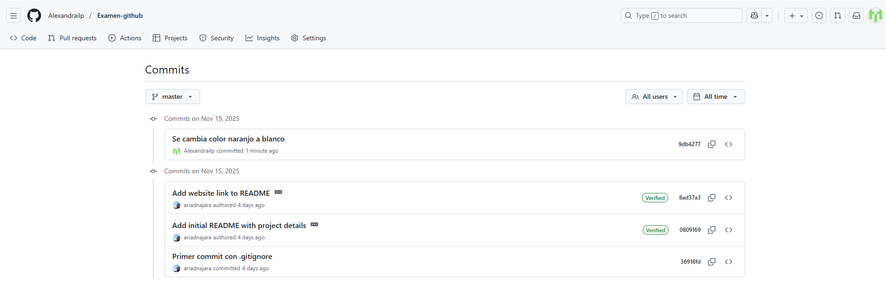
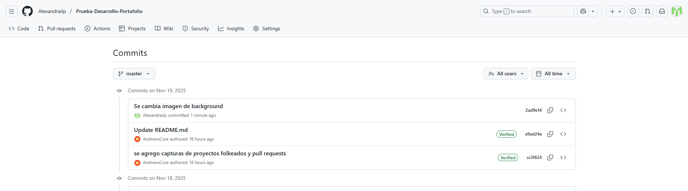

<h1 align="center">
   
  Portafolio Profesional - [Alexandra Lara]
   
</h1>

<h4 align="center">Este proyecto es mi portafolio profesional, diseñado para presentar mi experiencia, estudios, proyectos y medios de contacto de manera clara, moderna y minimalista.  
Incluye una interfaz totalmente responsive, un slider optimizado, sección de portafolio adaptable, y diseño visual basado en iconografía FontAwesome.</h4>

## Ver Portafolio

👉   <a href="https://alexandrailp.github.io/Portafolio/">Portafolio</a> 

## 🖼️ Vista General

El diseño está orientado a:
- Minimalismo  
- Legibilidad  
- Uso sutil de colores  
- Elementos centrados  
- Buen ratio tipográfico  
- Espaciados amplios para mejorar lectura  

Incluye ajustes especiales para:
- Navbar transparente sobre imagen
- Slider centrado en todos los tamaños
- Sección portafolio responsiva con grid adaptable

To clone and run this application, you'll need [Git](https://git-scm.com) and [Node.js](https://nodejs.org/en/download/) (which comes with [npm](http://npmjs.com)) installed on your computer. From your command line:

## 📌 Secciones principales

### **1. Inicio / Header**
Presentación inicial con imagen hero, navbar transparente sobre imagen y presentación personal breve.

### **2. Educación**
Resumen profesional, experiencia relevante, habilidades y enfoque de trabajo.

### **3. Experiencia**
Texto destacado como:
- Toma de radiografías durante Campaña de Invierno 2023.  
- Posterior participación en toma de exámenes: **mamografías y radiografías**.  
- Cargo de **coordinadora subrogante** de la unidad entre diciembre 2023 y febrero 2025.

### **4. Portafolio**
Galería responsive de proyectos (con grid flexible).  
- Slider centrado, con imágenes que mantienen su proporción y no se deforman en mobile.
- Sección minimalista con íconos obtenidos en FontAwesome

## 🧩 Tecnologías utilizadas

| Tecnología | Uso |
|-----------|------|
| **HTML5** | Maquetación del sitio |
| **CSS3** | Estilos personalizados |
| **Bootstrap 5** | Grillas, navbar, layout responsive |
| **FontAwesome** | Iconografía minimalista |
| **JavaScript Vanilla** | Animaciones, slider, interactividad |

## 📱 Responsividad

El sitio se adapta completamente a:
- Desktop (pantallas grandes)
- Tablets
- Mobile (incluye corrección de deformaciones en slider)

## 📝 Mejoras Futuras

- Agregar modo oscuro
- Integrar formulario con envío real vía backend
- Animaciones con AOS o GSAP
- Página para descarga de CV

## 📩 Contacto

- Email: alexandrailp.r@gmail.com
- LinkedIn: https://linkedin.com/in/alexandrailp

## © Derechos Reservados

© [2025] [Alexandrailp. Todos los derechos reservados.

---

## Fork y commits 

